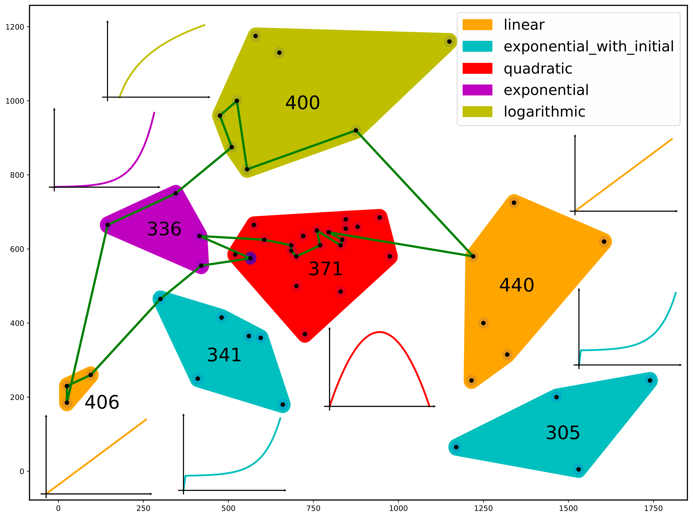

# Clustered Orienteering Problem with Function-based Rewards

## Vinícius L. C. Faria\ Douglas G. Macharet

###
Computer Vision and Robotics Laboratory (VeRLab)\
Department of Computer Science\
Universidade Federal de Minas Gerais\
Brazil

Implementation for the Clustered Orienteering Problem with Function-based Rewards, utilizing a Genetic Algorithm heuristic.




## Installing

To run the project, first create a virtual environment and install the required libraries:

```console
$ python3 -m venv venv
$ source venv/bin/active
$ pip install -r requirements.txt
```

## Executing

The project can be executed for a single instance with `main.py`, which prints to standard output and also plots the result. Alternatively, you can also run instances in bulk with `Benchmarker.py`, which runs a list of instances using different functions attributions and methods, saving results to .csv files.

### Running for a single instance

Runs a single instance with specified parameters. Also outputs a visualization. General usage of the program is as below:

```console
$ python main.py [-h] [--mutMove rate] [--mutPoint rate] [--single | --singleSeq] [-d default-func] instancePath popsize ngen cxpb mutpb stallCheck
```

For basic usage, pass the positional parameters, which are the needed Genetic Algorithm parameters. An example of a simple usage, using an instance which has random function to cluster association:

```console
$ python main.py ./sop-instances-random/11berlin52_T100_p2.sop 300 500 0.7 0.3 100
```

For instances which do not have a set to function to cluster associations, as the ones in `./sop-instances`, you may want to also pass a default function, which all of the clusters will be associated.

```console
$ python main.py ./sop-instances/11berlin52_T100_p2.sop 300 500 0.7 0.3 100 -d quadratic
```

Alternative implementations, such as the non-sequential single-objective and the sequential single-objective can also be tested with --single and --singleSeq, respectively. Note that the sequential version does not support visualization.

Additional parameters mentioned in the paper, such as $\mu$ and $\nu$ can be also be specified using the options `mutPoint` and `mutMove` respectively, and passing a $[0,1]$ value.

For more details on each parameter, run `python main.py -h`.

### Running in bulk using `Benchmarker.py`

The benchmarker can be run with a list of instances to execute with:

```console
$ python Benchmarker.py <instanceListPath> <execs> [--multi] [--single] [--singleSeq]
```

The specific methods to be executed can be chosen with the options `--multi`, `--single` and `singleSeq` for the non-sequential multi-objective, non-sequential single-objective and sequential single objetive implementations, respectively. In case none are specified, the benchmarker will run them all.

The benchmarker executes, also executes all combinations of function to cluster association: it will run all clusters as linear, quadratic, exponential and logarithmic, as well as the random function attribution in `sop-instances-random`. **In the end, the benchmarker will execute, for each combination of method and cluster association, each given instance `exec` times**.

The parameters for the genetic algorithm are not specified due to the sake of keeping things simple, and are equivalent to the ones presented in the paper. If you wish to tune them or have a finer control, manual editing of `Benchmarker.py` is required.

### Understanding instances

Instances in `./sop-instances` are taken originally taken from [vns-sop's dataset](https://github.com/ctu-mrs/vns-sop), which is based on the GTSP dataset, with the addition of clusters with corresponding values. Although originally used for the SOP, the same instances were used here, and interpreted as a COP problem. Also, for attributing random functions to clusters, the same instances were adapted by adding a random function to each original cluster. For more information about the original instances, refer to [VNS-SOP paper](https://www.sciencedirect.com/science/article/pii/S0377221719300827).

The name of each instance follows the pattern: `[num_clusters][instance-name][num_customers]_[RND_]?T<omega>_p[1|2]`. Where:

- `num_clusters`: Number of clusters in the instance
- `instance-name`: Name of the instance. All instances with the same name have the same customer positions. "RND" and regular instances also have the same customer to cluster assignment, but only with themselves: "RND" has the same association with other "RND" instances with the same name, and vice-versa.
- `num_customers`: Number of customers in the instance
- `RND`: Optional portion, indicates that the customer to cluster association is done at random, meaning clusters are no longer spatially proximate.
- `omega`: The parameter omega, which sets TMAX to be a certain % of the best known TSP solution for that instance. For example, in `T100`, all points can be visited, since it is the solution of the TSP. Lower `omega` values restricts TMAX even further, with `T80`, for example, representing 80% of `T100`'s TMAX.
- `p1/p2`: These determine the max profit of each cluster. `p1` sets the profit of each cluster as it's size (number of customers), while `p2` attributes the reward of each cluster randomly.
